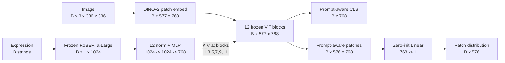
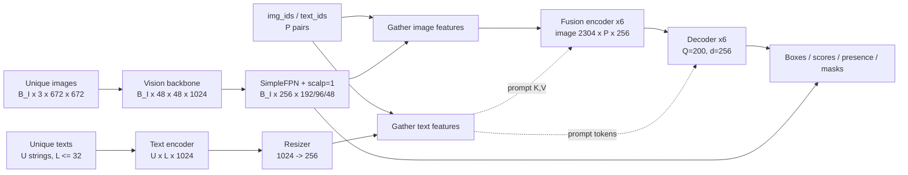
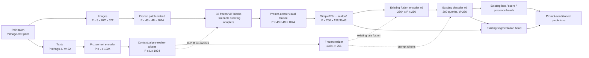
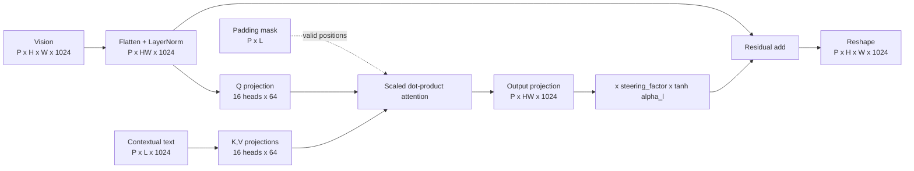

# 从 SteerViT 到 SteerSAM：架构分析与实现指南

> 文档状态：设计提案（positive-pair data loader 已实现，SteerSAM 模型尚未实现）
> 适用范围：当前仓库的 SAM3 **图像模型（image pipeline）**与 COCO 微调流程；不包含 video pipeline
> 源码基线：本文以本地 `sam3/` 和 `SteerViT/` 源码为准；论文用于解释设计动机和交叉验证
> 最后核对日期：2026-09-24（已包含提交 `299429c` 的 COCO 空 query 过滤语义）

## 1. 目标与结论先行

本文要解决的不是“把 SteerViT 的一个 cross-attention 类复制进 SAM3”，而是下面这个更完整的问题：

1. 在冻结 SAM3 vision backbone 和 language backbone 原有参数的前提下，引入少量可训练的 steering adapter；
2. 让文本在视觉主干内部就能改变视觉 token，而不只是等到现有 fusion encoder 才参与计算；
3. 保留 SAM3 已有的 late-fusion 编码器、检测解码器和分割头，形成 **early steering + late fusion** 的混合架构；
4. 保证训练数据的图像—文本映射、padding mask、冻结策略、优化器参数组和 checkpoint 加载彼此一致。

建议的第一版 SteerSAM 如下：

- 使用 SAM3 文本编码器 `encoder` 产生的、尚未经过 `resizer` 的 **1024 维 contextual text tokens** 作为 steering 信息；
- steering 是默认关闭的可选功能；关闭时不构造 adapter、不改变 forward 顺序，并完整保留原 SAM3 行为；
- 开启后，在可配置的 `steering_layers` 前插入零门控的 image-to-text cross-attention adapter；保守默认值为 4 个 global-attention block：`[7, 15, 23, 31]`，但必须消融更多注入密度；
- adapter 中视觉 token 是 query，文本 token 是 key/value；
- SAM3 原有的 `resizer: 1024 -> 256`、fusion encoder、decoder 和 mask head 全部保留；
- 冻结两个预训练 backbone 的原有参数，只训练新 adapter、gate 以及当前任务相关的非 backbone 模块；
- SteerSAM image data pipeline 使用专用的 `COCOPositivePairFromJSON`，直接从标注构建正 `(image, category)` pair；它不暴露 `include_negatives` 或 `category_chunk_size`，从数据合约上保证每条 record 只有一个正 prompt。物理 batch size 按显存选择，较大的 effective batch 优先通过梯度累积实现。

这不是无风险的“必然增强”。SteerViT 的实验证据说明 early language steering 对细粒度、指称性视觉特征有价值，但 SAM3 已经有很强的 late fusion 和 prompt-grounding 能力。SteerSAM 是否提高 COCO 检测/分割指标，必须通过严格消融实验验证。

---

## 2. 术语、符号与事实边界

本文使用以下符号：

| 符号 | 含义 |
|---|---|
| `B_I` | 一个 batch 中唯一图像的数量 |
| `U` | 去重后文本字符串的数量 |
| `P` | 图像—文本 query pair 的数量 |
| `L` | 文本 token 数；SAM3 中 `L <= 32` |
| `H, W` | 当前视觉层的空间尺寸；本文的 672 配置在 SAM3 ViT 主干中为 `48, 48` |
| `D_v` | vision backbone 隐藏维度；SAM3 中为 `1024` |
| `D_t` | text encoder 隐藏维度；SAM3 encoder 中为 `1024` |
| `D` | SAM3 检测/融合空间维度，为 `256` |
| `Q` | object query 数量，当前为 `200` |

本文刻意区分三类内容：

- **已验证事实**：可由本地源码直接确认；
- **论文描述**：来自 [SteerViT 论文](https://arxiv.org/html/2604.02327v2) 或 [SAM3 论文](https://arxiv.org/html/2511.16719)；
- **SteerSAM 提案**：尚未实现、需要实验验证的设计选择。

与架构图配套的机器可读中间表示见 [steersam_architecture_ir.yaml](./steersam_architecture_ir.yaml)。它记录了节点、边、shape、源码依据和仍待验证的问题，方便后续生成 SVG/draw.io 图或同步代码变更。

---

## 3. SteerViT 为什么要做 early steering

### 3.1 动机

传统视觉语言系统常见的做法是：先让视觉编码器独立生成通用视觉特征，再在末端用文本去检索、融合或解码。这种 late fusion 计算高效，但视觉 backbone 在提取特征时并不知道用户究竟关心图中的哪一部分。

例如，同一张街景图对应以下两个提示：

- “左侧穿红衣服的人”；
- “右侧停放的蓝色自行车”。

如果视觉 backbone 完全与提示无关，它需要用同一套表示同时保留所有可能对象和属性。SteerViT 的核心主张是：**让文本在视觉 Transformer 的中间层就参与计算，使同一张图针对不同文本产生不同的视觉表示。**

SteerViT 并不重新训练整个视觉或语言模型。它冻结预训练 DINOv2 和 RoBERTa，只训练插入 ViT block 中的轻量 cross-attention、文本维度连接器和训练期分割头。这使其重点落在“如何引导”而不是“重新学习 backbone”。

### 3.2 核心公式

设第 `l` 层视觉 token 为 `X_l in R^(B x N x D_v)`，文本 token 为 `T in R^(B x L x D_v)`。SteerViT 在选定 ViT block 前计算：

```text
Delta_l = CrossAttention(Q = LN(X_l), K = T, V = T, mask = text_mask)
X'_l    = X_l + tanh(alpha_l) * Delta_l
X_{l+1} = FrozenViTBlock_l(X'_l)
```

其中 `alpha_l` 是每个 adapter 的可训练标量，并初始化为 `0`。所以初始化时：

```text
tanh(alpha_l) = 0  =>  X'_l = X_l
```

也就是说，加入 adapter 后模型起点与原视觉 backbone 严格一致。需要注意一个容易忽略的训练现象：在第一个优化步，cross-attention 权重会被零 gate 挡住，主要是 `alpha_l` 先获得梯度；当 gate 离开零点后，cross-attention 参数才开始获得非零梯度。这是预期行为，不应误判为 adapter 梯度故障。

### 3.3 本地源码中的真实实现

以下分析来自本地代码，而不是只根据论文概念推测。

#### 3.3.1 模型入口与文本连接器

[SteerViT/src/steervit/model.py](../SteerViT/src/steervit/model.py) 中：

- 默认视觉模型是 DINOv2 ViT-B/14；输入分辨率 `336 x 336`；
- patch grid 为 `24 x 24`，加上 CLS token 后共 `577` 个视觉 token；
- 视觉隐藏维度为 `768`；
- 文本模型是冻结的 RoBERTa-Large，输出 `B x L x 1024`；
- 文本先做 L2 normalization，再通过两层 MLP：`1024 -> 1024 -> 768`；
- 连接后的 `B x L x 768` 文本 token 被传入视觉 backbone；
- 分割头是一个零初始化的 `Linear(768, 1)`，逐 patch 产生 logit。

这里的 connector 不只是“为了多一层网络”，而是在解决 RoBERTa 与 DINOv2 隐藏维度不相同的问题。它也给模型一个可训练的跨模态对齐接口。

#### 3.3.2 ViT block 注入方式

[SteerViT/src/steervit/backbone.py](../SteerViT/src/steervit/backbone.py) 会修改 timm ViT block 的 forward 路径，使 gated cross-attention 在原 block 的 self-attention 和 MLP 之前执行。

默认配置 [SteerViT/configs/default.yaml](../SteerViT/configs/default.yaml) 将 cross-attention 层写为 `1, 3, ..., 25`。源码使用 `enumerate(self.trunk.blocks)` 的 0-based 索引，并且只在真实存在的 block 上创建 `GatedCrossAttention`。默认 DINOv2 ViT-B 只有 12 个 block（索引 `0...11`），所以实际存在、会生效的是：

```text
1, 3, 5, 7, 9, 11
```

即从第 2 个 block 开始，每隔一个 block 注入一次，共 6 次，占 12 层的 50%。高于 11 的配置索引在该 backbone 中没有对应层，会被遍历逻辑自然忽略，不能把配置列表长度误报为实际 adapter 数。源码没有解释保留 `13...25` 的具体原因，因此只能将其视为对更深模型的预留或遗留配置，不能断言默认模型实际执行了 13 个 adapter。

#### 3.3.3 Cross-attention 与 mask

[SteerViT/src/steervit/crossattention.py](../SteerViT/src/steervit/crossattention.py) 中的主要逻辑是：

- 视觉 token 产生 query；
- 文本 token 同时产生 key 和 value；
- 默认 `16` 个 head，每个 head 维度 `72`，内部 attention 维度为 `1152`；
- cross-attention 输出再投影回视觉维度 `768`；
- 文本 padding 位置不会被视觉 token attend；
- residual 使用 `tanh(alpha)` 零门控；
- 代码支持额外 gated FFN，但默认配置 `use_ffn: false`。

SteerViT 输入的联合 attention mask 中，视觉前缀位置和有效文本位置为 `True`；cross-attention 内部切掉视觉前缀，只保留文本部分，并把它传给 scaled-dot-product attention。在移植到 SAM3 时不能机械复制布尔 mask，因为不同 PyTorch API 对布尔值语义不同，见第 7.4 节。

#### 3.3.4 训练目标和冻结方式

[SteerViT/train.py](../SteerViT/train.py) 只允许名称包含以下字段的参数训练：

```text
cross_attn / connector / lin_seg_head
```

其余参数设置 `requires_grad=False`。训练数据处理位于 [SteerViT/src/steervit/train_data.py](../SteerViT/src/steervit/train_data.py)：目标 mask 被降采样到 patch grid，再归一化成 foreground patch 上的概率分布。线性头输出 `B x 576`，在 patch 维做 softmax，并用 soft cross-entropy 学习“文本所指区域的空间概率分布”。它并不是对 576 个 patch 分别做互不相关的二分类。

论文的消融结论与源码选择一致：early fusion、零门控、两层 connector 和指称分割监督是重要因素；额外 FFN 的收益有限且增加参数。因此 SteerSAM 第一版也不建议加 adapter FFN。

### 3.4 SteerViT 数据流



### 3.5 哪些是“核心思想”，哪些只是具体实现

可迁移的核心不是 DINOv2、RoBERTa 或 `336` 分辨率本身，而是：

1. **文本条件化发生在视觉主干内部**；
2. **视觉 token 查询文本 token**，从文本中选取与当前视觉位置有关的信息；
3. **预训练主干冻结，新路径轻量可训练**；
4. **零初始化 gate 保证初始模型退化为原模型**；
5. 使用定位/分割监督，让 steering 学到空间指向性。

不能直接照搬的部分包括输入分辨率、token 数、隐藏维度、注入层索引、文本 connector、训练头、数据 batch 结构和下游目标。它们都必须按 SAM3 的实际实现重新设计。

---

## 4. 当前 SAM3 的真实数据流

### 4.1 SAM3 是 late fusion，但需要更精确地描述

“SAM3 是 late fusion”基本正确，但完整说法应是：

- 图像先经过 vision backbone 和 FPN，生成**与文本无关**的多尺度视觉特征；
- 文本单独经过 language backbone；
- 随后的 fusion encoder 以视觉 token 为 query，并对 prompt token 做 cross-attention；
- decoder、box/class/presence head 和 segmentation head 继续使用 prompt-conditioned 特征。

因此 SAM3 不是“没有跨模态交互”，而是跨模态交互没有进入 vision backbone 的 32 个 ViT block。SteerSAM 的目标不是删除现有 late fusion，而是在它之前增加 prompt-aware visual encoding。

### 4.2 Vision backbone

[sam3/model_builder.py](../sam3/model_builder.py) 和 [sam3/model/vitdet.py](../sam3/model/vitdet.py) 定义的默认 image backbone 为：

本文后续实验统一使用 `resolution=672`；这也与当前冻结 backbone 配置中的 `scratch.resolution: 672` 一致：

```text
input image           B_I x 3 x 672 x 672
patch size            14 x 14
patch grid            48 x 48
number of tokens      2304
ViT hidden dim        1024
ViT depth             32
attention heads       16
global-attn blocks    7, 15, 23, 31
internal layout       B_I x 48 x 48 x 1024
```

`672` 同时能被 patch size `14` 整除，而且 `48 x 48` grid 能被 window size `24` 整除，因此 window partition 不需要空间 padding。其余非 global block 使用 window attention。SimpleFPN 将 `B_I x 1024 x 48 x 48` 变成四个 256 通道尺度：

```text
B_I x 256 x 192 x 192   # scale 4.0
B_I x 256 x  96 x  96   # scale 2.0
B_I x 256 x  48 x  48   # scale 1.0
B_I x 256 x  24 x  24   # scale 0.5
```

构建器使用 `scalp=1`，因此去掉最低分辨率的 `24 x 24` 层，实际保留 `{192, 96, 48}` 三个尺度。当前 [sam3/model/sam3_image.py](../sam3/model/sam3_image.py) 取最后一个保留层作为主要 fusion feature，所以按本地 672 配置是 `48 x 48 = 2304` 个视觉 token。

分辨率不能只改数据 transform。`resolution=672` 还必须传入 `build_sam3_image_model`，使 ViT/RoPE 和 decoder 的分辨率相关缓存同步构建；decoder 使用 `stride=14`，对应的坐标 grid 同样是 `672 // 14 = 48`。从 1008 checkpoint 加载时，分辨率相关的 `freqs_cis` buffer 应跳过并按 672 重新生成，其他可迁移权重继续加载。

> 注意：SAM3 论文描述的是默认分辨率下送入 detector 的特征路径，不能直接拿论文中的固定 token 数替代本地 672 配置。实现后仍须用 forward assertion 或日志确认实际 shape；本文以当前本地构建路径为准。

### 4.3 Language backbone：1024 维 encoder 与 256 维 resizer

用户提出的理解是正确的，并且源码还包含一个很重要的接口细节。

[sam3/model/text_encoder_ve.py](../sam3/model/text_encoder_ve.py) 中的 `VETextEncoder` 可以概括为：

```text
tokenized text
  -> encoder / TextTransformer
  -> contextual text_memory: B x L x 1024
  -> transpose:              L x B x 1024
  -> resizer (Linear):       L x B x 256
```

其中：

- `encoder` 的 width 是 `1024`，24 层、16 heads，最大 context length 为 `32`；
- `resizer` 是 `Linear(1024, 256)`；
- 返回给 SAM3 fusion/decoder 使用的 `language_features` 是 `L x B x 256`；
- 当前返回值中的 `language_embeds` 虽然是 `L x B x 1024`，但它来自 **encoder 之前的 token embedding**，不是 encoder 输出的 contextual 1024 维特征。

最后一点非常关键。SteerSAM 应使用包含上下文语义的 `text_memory`，而不是仅按词表查得的原始 token embedding。因此需要显式暴露“pre-resizer contextual tokens”。仅看到 `language_embeds` 是 1024 维就把它接入 adapter，会接错语义层级。

使用 pre-resizer 1024 维特征对 SteerSAM 有三个直接帮助：

1. 它与 SAM3 vision hidden dim 同为 `1024`，无需先压缩到 256 再升回 1024，避免信息瓶颈；
2. 它已经由 SAM3 的语言 encoder 做了上下文建模，比原始 token embedding 更适合作为 K/V；
3. SAM3 的 image/text encoder 已通过预训练进行视觉语言对齐，因此第一版不必照搬 SteerViT 的 `1024 -> 1024 -> 768` connector。

这不意味着 resizer 可以删除。现有 late-fusion 模块的工作维度是 256，仍应继续使用同一份 contextual tokens 经过冻结 resizer 后的 `L x B x 256` 输出。

### 4.4 一张图、多条 prompt 的当前 batch 语义

SAM3 的 collator 会分别去重图像和文本，并用索引描述 query pair：

```text
images:          B_I x 3 x 672 x 672
find_text_batch: U strings
img_ids:         P                      # pair -> image row
text_ids:        P                      # pair -> unique-text row
```

[sam3/model/sam3_image.py](../sam3/model/sam3_image.py) 先对每张唯一图像只运行一次 backbone，然后用 `img_ids` 选择/复用视觉特征；文本也通过 `text_ids` 选择。这对 late fusion 很高效，因为图像特征与 prompt 无关。

当前冻结 backbone 配置 [coco2017_full_ft_mask_frozen_backbone.yaml](../sam3/train/configs/coco/coco2017_full_ft_mask_frozen_backbone.yaml) 已切换为：

```yaml
coco_json_loader:
  _target_: sam3.train.data.coco_json_loaders.COCOPositivePairFromJSON
  _partial_: true
```

loader 会扫描标注，为每个实际存在的 `(image_idx, category_id)` 建立一条索引。例如一张图同时含有猫、狗和人，数据集中对应三条 record：`(图, 猫)`、`(图, 狗)`、`(图, 人)`。同一类别的多个 instance 仍集合在该 pair 的同一条 query/target 中，不会再按 instance 拆分。

因此，数据集长度为：

```text
N_pairs = sum_i K_i
```

其中 `K_i` 是第 `i` 张图中不同正类别的数量，而不是实例数。这避免了通用 `COCO_FROM_JSON` 的 category chunk 概念混入 SteerSAM 的一对一合约。在当前 late-fusion baseline 中，这种拆分会放弃“同一图像的多个 prompt 共享一次视觉编码”的优化；但它正好为后续 prompt-conditioned vision backbone 提供明确的一对一输入。

这是从 late fusion 迁移到 early steering 时最大的系统级差异。

### 4.5 当前 SAM3 late-fusion workflow



---

## 5. 从 SteerViT 迁移到 SAM3：可借鉴与不可照搬之处

| SteerViT 设计 | SteerSAM 决策 | 原因 |
|---|---|---|
| 冻结视觉和文本主干 | 直接借鉴 | 降低可训练参数量，保留预训练能力；但必须让新 adapter 重新启用梯度 |
| 视觉 token 作 Q，文本作 K/V | 直接借鉴 | 输出仍保持视觉空间结构，容易接回原 ViT block |
| `tanh(alpha)`，`alpha=0` | 直接借鉴 | 初始化与原 SAM3 等价，降低破坏预训练特征的风险 |
| 每隔一个 DINO block 注入 | 转为可配置消融 | SAM3 有 32 层且分 window/global attention；4 个 global block 是保守默认，但 8/16 层方案必须实验比较 |
| RoBERTa `1024 -> 768` connector | 不照搬 | SAM3 contextual text 和 vision hidden 都是 1024；无维度不匹配 |
| 独立 linear patch head | 第一版不照搬 | SAM3 已有成熟检测、presence、instance/semantic mask 监督，可直接训练 steering |
| 单个图文 pair 的 backbone forward | 需要适配数据管线 | SAM3 当前允许一图多 prompt 并复用图像特征；early steering 后此复用不再成立 |
| monkey-patch timm block | 不照搬 | SAM3 自有 `ViT`/`Block`，应使用显式模块和参数，利于 checkpoint、导出和测试 |
| 可选 gated FFN | 第一版不采用 | SteerViT 消融不支持其必要性，且会显著增加参数和显存 |
| 指称分割 soft-CE | 后续可选辅助项 | 可能强化空间 steering，但第一版应先检验现有 SAM3 losses 是否足够 |

### 5.1 late fusion 会不会与 SteerViT 思想冲突

不会产生结构上的逻辑冲突，但会改变计算语义和成本。

SteerSAM 中两种交互承担不同职责：

- **early steering**：让视觉 backbone 选择性地编码与 prompt 相关的对象、部件、属性和空间关系；
- **late fusion**：在 256 维 detector 空间中完成图文融合、object-query 解码、分类、定位和精细 mask 预测。

两者不是重复模块的简单堆叠。早期路径改变进入 FPN 的视觉表示；后期路径仍负责将这些表示转化为 SAM3 现有输出。实际风险主要有：

1. prompt-specific 特征使一图多 prompt 的复用失效，计算量上升；
2. steering 过强可能损害未被 prompt 点名但对检测有用的上下文；
3. early 与 late 两条语言路径可能学习到冗余功能；
4. COCO 类别名较短、语义较粗，收益可能小于 RefCOCO 等细粒度指称数据；
5. 本文仅覆盖 image pipeline；video pipeline 不在当前设计、代码修改和实验范围内。

零 gate、保留 late fusion、限制注入层数和系统化消融就是针对这些风险的设计。

---

## 6. SteerSAM 总体设计

### 6.1 总体 workflow



### 6.2 Adapter 内部结构

第 `l` 个 adapter 接收：

```text
x_l:               P x H x W x 1024
text_contextual:   P x L x 1024
text_padding_mask: P x L, bool, True 表示 padding/忽略
```

推荐内部结构：



计算形式为：

```python
delta = cross_attention(
    q=norm(image_tokens),
    k=text_contextual,
    v=text_contextual,
    mask=text_valid_mask,
)
output = image_tokens + steering_factor * torch.tanh(alpha) * delta
```

初始建议：

| 项 | 第一版设置 |
|---|---|
| 输入/输出 dim | 1024 |
| heads | 16 |
| head dim | 64 |
| inner attention dim | 1024 |
| 注入位置 | 可配置；保守默认在 block `7, 15, 23, 31` 之前 |
| gate | 每层一个 scalar `alpha_l`，初始化为 0 |
| steering factor | 默认 1.0，可在推理/消融中调整 |
| adapter FFN | 无 |
| dropout | 初始为 0，后续按过拟合情况消融 |

粗略参数量：每个 adapter 的 Q/K/V/out 四个 `1024 x 1024` 投影约为 `4.2M` 参数；4/8/16 个分别约为 `16.8M`、`33.6M`、`67.1M`，另加 LayerNorm、bias 和 gate。实现后应通过参数统计脚本报告精确数字。adapter 的计算还随 `P x H x W x L` 线性增长，因此不能只按参数量选择层数。

### 6.3 注入层必须可配置

SteerViT 默认 ViT-B 实际在 `[1,3,5,7,9,11]` 六层注入，占 12 层的 50%。因此，SteerSAM 不能把 4 个 global block 描述成已经确定的最佳结构。将 `[7,15,23,31]` 作为开启 steering 后的保守默认值，是工程与语义折中：

- 4 个位置覆盖浅、中、深层；
- 与 SAM3 已有 global-attention 节点自然对齐；
- 比 16 个“隔层注入”显著节省参数、显存和文本 K/V 计算；
- steering 先改变 token，再由 global self-attention 在全图传播。

另一方面，cross-attention 本身对每一个视觉位置分别查询文本，并不要求它只能位于 global self-attention block。因此在 window-attention block 前注入也是合法的；是否更有效必须由实验决定。

后续消融应比较：

```text
last-only:       [31]                              # 约 4.2M adapter 参数
middle-and-last: [15, 31]                          # 约 8.4M
global-four:     [7, 15, 23, 31]                   # 约 16.8M，保守默认
every-four:      [3, 7, 11, 15, 19, 23, 27, 31]   # 约 33.6M
every-other:     [1, 3, 5, ..., 31]                # 约 67.1M，SteerViT-like 密度
```

配置接口应接受任意合法、无重复、递增的 block index，并检查 `0 <= index < 32`。实验报告必须同时给出注入层、trainable 参数量、吞吐和显存，避免仅凭最终精度比较不等成本的模型。

### 6.4 文本的两条并行路径

同一个冻结 text encoder 输出应服务两条路径：

```text
contextual 1024 tokens
  |-- directly --> steering adapters in vision backbone
  `-- resizer 1024->256 --> existing fusion encoder / decoder / mask head
```

这样做不会重复运行 text encoder，也不会用 256 维结果逆投影回 1024。第一版不增加 connector；如果实验显示需要额外对齐，可加入可训练的 `1024 -> 1024` projection 或 bottleneck MLP 作为独立消融，但不应默认引入。

### 6.5 Positive-pair loader 与图文一对一合约

early steering 要求每条视觉特征与一条 prompt 一一对应：

```text
pair_images: P x 3 x 672 x 672
pair_text:   P strings
pair 0 -> image A + "person"
pair 1 -> image A + "bicycle"  # 必须得到另一份 backbone 输出
pair 2 -> image B + "dog"
```

对于 SteerSAM image pipeline，默认数据合约由专用 loader 表达：

```yaml
coco_json_loader:
  _target_: sam3.train.data.coco_json_loaders.COCOPositivePairFromJSON
  _partial_: true
```

`COCOPositivePairFromJSON` 不暴露 `include_negatives` 和 `category_chunk_size`，因此不存在忘记将某个参数设为 `false` 或 `1` 而破坏 pair 语义的情况。它直接从 annotation 表建立**正 image-category pair 数据集**，不枚举无标注类别，也不构建 `image_count x category_count` 的中间索引。在当前每条 record 仅含一张图和一条 query 的前提下，一个 DataLoader batch 满足：

```text
P = number_of_image_rows = physical_batch_size
img_ids = [0, 1, ..., P-1]
```

注意：这里的 image rows 不等于“去重后的源 COCO image id 数量”。同一张源图的不同正类别是不同 records，collator 会将它们作为独立 image rows 堆叠，它们也可能经过不同的随机增强。`find_text_batch` 仍会按文本字符串去重，所以去重文本数 `U` 可以小于 `P`，但 `text_ids` 会为每个 pair 指向正确的文本行。

与一条 image record 同时包含 `K_i` 个正类别的通用 loader 用法相比，变化是：

- 一条 record 只有一个正 prompt，从数据层就满足 prompt-conditioned backbone 的一对一要求；
- 数据集长度从“有效图像记录数”变为“正 image-category pair 总数”，扩大倍数与每张图的正类别数有关，不是固定 80 倍；
- 同一源图像的不同 records 可能接受不同随机增强，因此不严格等价于在同一增强图像上联合处理全部正类别；
- 物理 batch size 只决定每步处理多少个 pair；它是显存和吞吐的超参数，不是 pair 语义的正确性开关；
- 若显存不足，应降低物理 batch size，并通过 gradient accumulation 恢复目标 effective batch。

因此，pair 拆分由 loader 的索引方式解决；增大 batch size 不是正确性的必要条件，也不能恢复原先的共享视觉计算或完全相同的采样过程。frozen-backbone YAML 中的 train/val physical batch size 只是 baseline 的吞吐调优参数；接入 SteerSAM adapter 后必须重新测量，不应盲目继承。

专用 loader 将 positive-only 行为固化为默认且唯一的语义。它的数据集规模跟随实际标注的正 image-category pairs，而不是 `N_images x C` 笛卡尔积，因而更适合扩展到 LVIS 等大词表数据集。通用 `COCO_FROM_JSON` 的既有默认行为保持不变，避免影响其他 SAM3 数据配置。

因此，当前 SteerSAM 设计、训练配置、测试和实验方案统一按 positive-only 数据处理，不增加其他类别组合分支。

对于当前 positive-pair loader，模型不需要通过 `images[img_ids]` 再复制一份 pair images；`img_batch` 本身已经是 pair batch。仅文本需要从 `U` 条去重结果 gather 到 `P` 条 pair：

```python
assert torch.equal(img_ids, torch.arange(P, device=img_ids.device))
pair_images = images                           # P x 3 x 672 x 672
pair_text_1024 = text_1024[:, text_ids]        # L x P x 1024
pair_text_256 = text_256[:, text_ids]          # L x P x 256
pair_padding_mask = padding_mask[text_ids]     # P x L
```

模型侧仍应检查 steering 模式下的 pair 合约，不能只相信 YAML：`len(img_ids) == len(text_ids) == len(img_batch)`，且 `img_ids` 必须是连续的 `arange(P)`。未来若接入天然一图多 prompt 的数据集，应在数据层提供对应的 positive-pair adapter，而不在模型 forward 中静默复制大量图像。

“把同一图像的多个类别文本先聚合成一个 set embedding，再只跑一次视觉 backbone”虽然保留效率，但改变了问题：得到的是 prompt-set-aware 特征，不是 query-specific 特征。这可以作为后续近似方案，不能冒充 SteerViT 的等价迁移。

---

## 7. 具体代码改造方案

### 7.0 非侵入性与开关约束

SteerSAM 不替换 SAM3 原有 image pipeline。构建接口增加一个默认关闭的开关：

```python
enable_steering: bool = False
```

必须满足两条互斥路径：

```text
enable_steering=False
  -> 构造原 VETextEncoder / ViT / SAM3VLBackbone / Sam3Image
  -> image-first，继续复用 prompt-independent image features
  -> 不构造 adapter，不 materialize pair batch
  -> 行为、参数名和 checkpoint 加载保持原 SAM3

enable_steering=True
  -> 构造 SteerSAM 专用子类/包装模块
  -> text-first，建立 image-prompt pair
  -> 在配置指定的 ViT blocks 前运行 adapter
  -> 保留原 fusion encoder、decoder 和 heads
```

优先通过新增文件和继承/组合完成，避免在原 `forward` 中散布大量 `if enable_steering`。原模块只在确实无法通过子类复用时增加小而稳定的扩展点。

### 7.1 新增 `sam3/model/steering.py`

**当前状态**：没有在 vision trunk 内使用文本的模块。

**新增职责**：实现独立、可测试的零门控 cross-attention adapter，不依赖 dataset 或完整 SAM3。

建议结构：

```python
class GatedVisionLanguageAdapter(nn.Module):
    def __init__(
        self,
        vision_dim: int = 1024,
        text_dim: int = 1024,
        num_heads: int = 16,
        head_dim: int = 64,
        dropout: float = 0.0,
    ): ...

    def forward(
        self,
        image: Tensor,              # P,H,W,1024
        text: Tensor,               # P,L,1024
        text_padding_mask: Tensor,  # P,L; True=ignore
        steering_factor: float | Tensor = 1.0,
    ) -> Tensor: ...                # P,H,W,1024
```

实现要求：

- 用注册在 module 内的 `nn.Linear` 完成 Q/K/V/out projection；
- `alpha` 必须是 `nn.Parameter(torch.zeros(()))`；
- gate 乘在 output projection 后、residual add 前；
- 全 padding 文本需要安全处理，避免 SDPA 产生 NaN；可选择直接 bypass 对应样本；
- 输入 dtype/device 应继承视觉 token，mask 转换不可改变特征 dtype；
- 支持 AMP，但单元测试至少覆盖 float32 CPU；
- 不在模块内部调用 tokenizer 或读取 batch object。

### 7.2 新增 `sam3/model/steersam_text_encoder.py`

**当前代码在做什么**：`VETextEncoder.forward` 运行 tokenizer/encoder，得到 `B x L x 1024` contextual memory；随后转为 `L x B x 1024`，通过 resizer 得到 `L x B x 256`。现有第三个返回值是 encoder 之前的 raw token embeddings。

**为什么新增**：SteerSAM 需要 encoder 之后、resizer 之前的 contextual 1024 token。现有接口没有返回它，但原 SAM3 的三元组返回协议不应被 SteerSAM 强制改变。

**推荐实现**：新增 `SteerSAMTextEncoder(VETextEncoder)`，提供结构化 `encode_for_steering`；继承的普通 `forward` 不变。例如：

```python
@dataclass
class TextEncoderOutput:
    padding_mask: Tensor           # B,L; True=ignore
    features: Tensor               # L,B,256
    contextual_pre_resizer: Tensor # L,B,1024
    token_embeddings: Tensor       # L,B,1024

class SteerSAMTextEncoder(VETextEncoder):
    def encode_for_steering(...) -> TextEncoderOutput: ...
```

接口约束：

- `contextual_pre_resizer` 必须来自 `text_memory`，不能把 `inputs_embeds` 改名后复用；
- `padding_mask` 延续 SAM3 语义：`True` 表示 padding/ignore；
- pre-encoded text 分支也要携带 contextual 1024 token；如果旧缓存不包含它，应显式标记不支持 steering，而不是用 raw embedding 替代；
- language backbone 冻结时，`encoder` 与 `resizer` 均保持 `requires_grad=False`。
- `enable_steering=False` 时 builder 仍实例化原 `VETextEncoder`，不会触发这一新接口。

### 7.3 新增 `sam3/model/steersam_vit.py`

**当前代码在做什么**：`ViT.forward(x)` 完成 patch embedding后，依次遍历 32 个 `Block`；block 仅接收视觉 `x`，训练时可能经过 activation checkpoint。

**为什么新增**：需要在指定 block 前插入 adapter，并把文本及 mask 传入 trunk；使用子类可以保持原 `ViT.forward(x)` 完全不变。

**推荐修改**：

```python
class SteerableViT(ViT):
    def __init__(..., steering_adapters=None, steering_layers=()):
        self.steering_adapters = nn.ModuleDict(...)

    def forward(
        self,
        x,
        steering_text=None,          # P,L,1024
        steering_padding_mask=None,  # P,L
        steering_factor=1.0,
    ):
        x = self.patch_embed(x)       # P,48,48,1024 at resolution=672
        for i, blk in enumerate(self.blocks):
            if str(i) in self.steering_adapters and steering_text is not None:
                x = self.steering_adapters[str(i)](
                    x, steering_text, steering_padding_mask, steering_factor
                )
            x = blk(x)
        ...
```

注意事项：

- 使用 `ModuleDict`/`ModuleList` 正式注册模块，不使用 monkey patch；
- adapter 必须在原 block 前执行，才能与 SteerViT 语义一致；
- activation checkpoint 函数需要同时接收或闭包捕获 text/mask；先写 CPU 前向和普通反向测试，再启用 checkpoint；
- 原 `ViT` 不注册 adapter；只有 `SteerableViT` 注册 adapter；
- `steering_layers` 必须是可配置集合，校验索引范围、顺序和重复项；
- `steering_factor=0` 和 `alpha=0` 都应产生 baseline 等价输出。

### 7.4 正确处理 attention mask

这是最容易产生“代码能跑但结果错误”的位置。

当前 SAM3 text padding mask 为：

```text
shape: P x L
dtype: bool
True: padding，应忽略
False: 有效文本 token
```

但 PyTorch 接口语义不同：

- `nn.MultiheadAttention.key_padding_mask`：`True` 表示忽略；可直接传 SAM3 mask；
- `torch.nn.functional.scaled_dot_product_attention` 的 bool `attn_mask`：`True` 表示允许参与 attention。

所以若直接调用 SDPA，应构造：

```python
valid_mask = (~text_padding_mask)[:, None, None, :]  # P,1,1,L
```

并在测试中用“改变 padding token 数值不应改变输出”的性质验证 mask，而不能只检查 shape。

### 7.5 新增 `sam3/model/steersam_neck.py`

**当前代码在做什么**：`ImageEncoder.forward` 只把 image 传给 trunk，然后将 trunk 输出送入 FPN。

**为什么新增**：steering context 必须透传给 `SteerableViT.forward`，但原 `Sam3DualViTDetNeck` 的 image-only 接口应保持不变。新增轻量子类 `SteerSAMViTDetNeck`，复用原 FPN 参数与逻辑，仅扩展 conditioned forward。

**计划接口**：

```python
def forward(
    self,
    sample: Tensor,
    steering_text: Tensor | None = None,
    steering_padding_mask: Tensor | None = None,
    steering_factor: float = 1.0,
):
    features = self.trunk(
        sample,
        steering_text=steering_text,
        steering_padding_mask=steering_padding_mask,
        steering_factor=steering_factor,
    )
    return self.neck(features)
```

672 配置下，FPN 保留输出为 `P x 256 x {192,96,48}^2`。原 neck 不受影响。

### 7.6 新增 `sam3/model/steersam_backbone.py`

**当前代码在做什么**：`SAM3VLBackbone` 明确保持 image/text 两条独立前向；`forward_image` 调视觉主干，`forward_text` 暴露 256 维语言特征、mask 和 raw 1024 维 embedding。

**为什么新增**：SteerSAM 需要先得到 contextual text，再运行 conditioned image forward；原 `SAM3VLBackbone` 的 image/text 分离 API 应保持不变。

**计划修改**：

- 新增 `SteerSAMVLBackbone(SAM3VLBackbone)`；
- `forward_text_for_steering` 返回 `language_contextual_pre_resizer: L x U x 1024`，同时保留 256 维 late-fusion features；
- 新增显式 `forward_conditioned_image(...)`，接受 pair text/mask/factor；
- 返回的 FPN feature shape 为 `P x 256 x {192,96,48}^2`；
- `enable_steering=False` 时 builder 继续使用原 `SAM3VLBackbone`，不经过这些接口。

### 7.7 新增 `sam3/model/steersam_image.py`

**当前代码在做什么**：当前 `forward` 先运行 image backbone，再运行 text backbone；随后 `_get_img_feats` 用 `img_ids` 复用图像特征。

**为什么新增**：early steering 必须先编码文本；视觉特征已经与 pair 绑定，不能继续把 prompt-independent 图像输出复用给多条 query。新增 `SteerSAMImage(Sam3Image)`，覆盖顶层 forward/pair 构建，复用父类的 fusion、decoder、loss 输出协议，避免改写原 `Sam3Image.forward`。

**计划修改流程**：

1. 调 `forward_text`，一次编码 `U` 条去重文本；
2. 用 `text_ids` gather 得到 `P x L x 1024` contextual text 与 `P x L` mask；
3. 验证 positive-pair 合约：`len(img_batch) == P` 且 `img_ids == arange(P)`；
4. 直接使用 `img_batch: P x 3 x 672 x 672` 作为 pair images，不做二次 materialization；
5. conditioned image forward 产生 `P` 份 prompt-specific FPN features；
6. 256 维 prompt token 仍由 `text_ids` gather，并送入现有 fusion encoder/decoder；
7. 该类只在开关开启时构造；关闭时直接使用原 `Sam3Image`，不应通过该类模拟 baseline。

建议把合约检查封装为纯函数并单测：

```python
def validate_positive_pair_batch(images, img_ids, text_ids):
    pair_count = len(images)
    assert len(img_ids) == len(text_ids) == pair_count
    assert torch.equal(img_ids, torch.arange(pair_count, device=img_ids.device))
```

还应加入：

- `len(img_ids) == len(text_ids) == P` 断言；
- adapter text batch 与 pair image batch 一致的断言；
- `img_ids == arange(P)` 断言，防止误用一图多 query 的 loader；
- 空 prompt 和重复文本测试；数据 query 均来自有效的正 image-category records。

### 7.8 修改 `sam3/model_builder.py`

**当前代码在做什么**：构造 ViT、FPN、text encoder、fusion encoder、decoder 和 mask head；当前冻结配置还可对整个 vision/language backbone 设置 `requires_grad_(False)`。

**为什么修改**：这是原代码中唯一必要的架构选择入口。需要在 image builder 中根据开关选择原 SAM3 类或 SteerSAM 类，并避免“冻结整个 vision backbone”顺带冻结其中新加入的 adapter。

建议新增构建参数：

```python
enable_steering: bool = False
steering_layers: tuple[int, ...] = (7, 15, 23, 31)
steering_num_heads: int = 16
steering_head_dim: int = 64
steering_dropout: float = 0.0
steering_factor: float = 1.0
freeze_pretrained_vision: bool = True
freeze_pretrained_language: bool = True
```

构建分支应近似为：

```python
if not enable_steering:
    # 完整保留当前构建路径
    return build_original_sam3_image_components(...)

# 仅 image pipeline 进入下列路径
return build_steersam_image_components(...)
```

冻结顺序建议为：

1. 构建完整模型（包括 adapters）；
2. 加载 SAM3 预训练 checkpoint，允许 adapter keys 缺失并单独记录；
3. 冻结预训练 vision/language 参数；
4. 显式将 `steering_adapters.parameters()` 设为 `requires_grad=True`；
5. 统计并打印 trainable/frozen 参数名和数量。

不建议把整个 vision forward 放进 `torch.no_grad()`：adapter 位于 trunk 内部，这会切断 adapter 的 autograd graph。只把原参数设为 `requires_grad=False` 即可节省这些参数的梯度和优化器状态；若未来要对 adapter 之前的连续 frozen prefix 使用 `no_grad`，必须按计算图分段实现并单独验证。

另一个细节是 module mode。调用顶层 `model.train()` 会递归把冻结 backbone 设为 train mode，drop-path 等随机行为仍可能启用。可增加一个 helper，在训练开始后让冻结的基础 block 保持 eval，同时只让 adapter 和任务头保持 train。是否保留 drop-path 应作为明确配置，而不是冻结后的偶然副作用。

`build_sam3_video_model` 不增加 steering 参数、不修改构建流程，也不纳入本项目测试范围。

### 7.9 修改优化器：`sam3/train/optim/optimizer.py` 与 `sam3/train/trainer.py`

**当前风险**：现有 optimizer 参数组校验倾向于覆盖模型参数；冻结配置通过给 backbone 设置零学习率来维持完整参数组。加入 adapter 后，如果 broad pattern 如 `backbone.vision_backbone.*` 设为零 LR，它也会匹配 adapter，从而让 adapter 实际不更新；再添加一条 adapter LR 规则还可能产生参数组重叠。

**推荐方案**：优化器只接收 `requires_grad=True` 的参数。

```python
trainable = {
    name: p for name, p in model.named_parameters() if p.requires_grad
}
```

并将参数组校验的 expected set 改为 trainable set，而不是所有模型参数。然后：

- 删除 SteerSAM 配置中冻结 backbone 的零 LR 参数组；
- 为 `steering_adapters` 建独立 LR/weight-decay 组；
- 其余非 backbone 模块沿用微调 LR；
- `alpha` gate 通常设 `weight_decay=0`；
- 在创建 optimizer 后断言每个 trainable 参数恰好出现一次；
- 记录 adapter、head、其他模块各自的参数量。

这比“参数仍在 optimizer 里但 LR=0”更接近真正的 `requires_grad=False` 节省：冻结参数不分配梯度，也不创建 AdamW 的一阶/二阶状态。

### 7.10 新增训练配置

建议新增而不是覆盖基线：

```text
sam3/train/configs/coco/coco2017_steersam_mask.yaml
```

它应从现有 [coco2017_full_ft_mask_frozen_backbone.yaml](../sam3/train/configs/coco/coco2017_full_ft_mask_frozen_backbone.yaml) 继承思路，但至少调整：

```yaml
# 示意字段；最终键名应与完成后的 builder/Hydra 接口一致
model:
  enable_steering: true
  resolution: 672
  steering_layers: [7, 15, 23, 31]
  steering_num_heads: 16
  steering_head_dim: 64
  steering_factor: 1.0
  freeze_pretrained_vision: true
  freeze_pretrained_language: true

data:
  train:
    coco_json_loader:
      _target_: sam3.train.data.coco_json_loaders.COCOPositivePairFromJSON
      _partial_: true
  val:
    coco_json_loader:
      _target_: sam3.train.data.coco_json_loaders.COCOPositivePairFromJSON
      _partial_: true

optimizer:
  # 只为 requires_grad=True 参数建组
  # adapter 和 alpha 使用显式 pattern，且不能与 broad backbone rule 重叠
```

`COCOPositivePairFromJSON` 是 SteerSAM image pipeline 的默认 positive-only 数据合约，也已用于当前 frozen-backbone baseline。它在 API 上不接受 `include_negatives` 和 `category_chunk_size`；所以新增 COCO/LVIS 适配时，应继承“直接索引正 pair”的合约，而不是重新暴露这两个开关。SteerSAM 配置不应盲目继承 baseline 的 physical batch size；应先测量 adapter 开启后的峰值显存和吞吐，再确定 physical batch size，并通过 gradient accumulation 对齐 effective batch。

上述是独立 SteerSAM 实验配置，因此显式开启 steering。公共 image builder 的代码默认值和原 SAM3/基线配置仍必须是 `enable_steering: false`。不要在原基线 YAML 中隐式打开该功能。

### 7.11 checkpoint 兼容

SteerSAM 从普通 SAM3 checkpoint 启动时，adapter 参数不存在是预期现象：

- 先构造含 adapter 的模型；
- 用 `strict=False` 加载；
- 允许 missing keys 只来自 `steering_adapters.*`；
- unexpected keys 和其他 missing keys 仍应报错或强警告；
- adapter gate 为零，因此加载后的 baseline parity 可测试；
- 训练 checkpoint 应保存 adapter 与非 backbone heads 的状态，并支持完整 resume。

### 7.12 建议新增测试

仓库当前没有固定的顶层 `tests/` 结构时，可建立：

```text
tests/model/test_steering.py
tests/model/test_text_encoder_outputs.py
tests/model/test_steering_pair_mapping.py
tests/train/test_trainable_param_groups.py
```

最低测试矩阵：

| 测试 | 验证内容 |
|---|---|
| shape test | adapter 输入输出都是 `P,H,W,1024` |
| zero-gate parity | `alpha=0` 时输出逐元素等于输入 |
| mask invariance | 改变 padding token 的值不改变输出 |
| nonzero prompt sensitivity | gate 非零时，不同文本可产生不同视觉输出 |
| gradient test | frozen backbone 无 grad；adapter/gate 和任务头有 grad |
| pair mapping | 重复图像、重复文本、交叉 `img_ids/text_ids` 映射正确 |
| optimizer coverage | 每个 trainable 参数出现一次，frozen 参数出现零次 |
| checkpoint test | 普通 SAM3 -> SteerSAM 只缺 adapter keys；resume 无缺失 |
| baseline integration | `enable_steering=False` 保持原输出结构和 shape |

所有这些都可先用小 tensor 或缩小版 ViT 在 CPU 上完成，不要求 GPU。

---

## 8. 冻结训练的精确定义

“freeze backbone”在 SteerSAM 中应定义为：

```text
冻结：
  vision patch embed
  32 个原始 ViT blocks
  vision norm / positional parameters
  text token embedding
  24 层 text transformer
  text resizer 1024 -> 256

训练：
  新增 steering adapters + alpha gates
  fusion encoder
  decoder
  box / class / presence heads
  segmentation head
  其他明确属于任务侧而非 backbone 的模块
```

需要根据实验目的决定 FPN 是否训练。本文推荐第一版训练 FPN，因为它连接被 steering 改变的 1024 维主干输出和原 256 维检测空间；若显存或过拟合明显，再增加“FPN frozen”消融。

`requires_grad=False` 带来的主要节省是：

- 不保存这些参数的 `.grad`；
- optimizer 不为它们创建 AdamW momentum/variance state；
- 不计算参数梯度。

但因为 adapter 位于视觉主干中，后续层仍需要对 adapter 输出反向传播，所以不能期待像完全冻结且整体 `no_grad` 的 backbone 那样省掉全部 activation。adapter 越早插入，需要保留/重算的后续计算图越长。这也是先只插 4 层并使用 checkpoint 的原因。

---

## 9. 训练目标与实验设计

### 9.1 第一阶段：直接使用 SAM3 原有损失

第一版不增加 SteerViT patch head，直接用 SAM3 当前的：

- 分类/匹配相关损失；
- box regression 与 GIoU 等定位损失；
- object presence；
- instance mask；
- semantic mask（若配置启用）。

只要 adapter 在预测路径中且 gate 开启，这些损失会把梯度传回 steering adapter。这样可以先回答最核心的问题：在相同任务监督下，early steering 是否比“冻结 backbone、只训练后端”更好。

### 9.2 可选第二阶段：辅助 patch steering loss

如果发现 gate 长期接近零或视觉 prompt sensitivity 不明显，可增加一个训练期辅助头：

```text
steered 48x48 tokens -> Linear(1024,1) -> P x 2304 logits
GT union mask -> downsample to 48x48 -> normalize foreground distribution
loss = soft cross-entropy
```

总损失：

```text
L_total = L_SAM3 + lambda_steer * L_patch
```

这更接近 SteerViT 的训练信号，但必须作为独立消融。当前数据合约只保留有效正 image-category pairs，因此辅助目标直接由对应正类别 mask 构造。

### 9.3 必做消融

至少比较：

| 实验 | Backbone | Adapter | 后端模块 | 目的 |
|---|---|---|---|---|
| A | frozen | 无 | train | 当前 frozen-backbone 基线 |
| B | frozen | train | train | SteerSAM 主方案 |
| C | frozen | train | frozen/最小训练 | 检查提升是否真正来自 adapter |
| D | full fine-tune | 无 | train | 与普通全量微调比较上限和成本 |
| E | frozen | gate 固定 0 | train | 检查结构/数据管线改动自身影响 |

再分别消融：

- 注入层 `[31]`、`[15,31]`、`[7,15,23,31]`、`[3,7,...,31]`、`[1,3,...,31]`，并同时报告参数量和吞吐；
- contextual 1024、raw embedding 1024、resized 256 后投影；
- connector 无/Linear/两层 MLP；
- `steering_factor`；
- 原损失 vs 加辅助 patch loss；
- COCO 类别名 vs 更描述性的 referring-expression 数据。

### 9.4 评估指标

除 box AP、mask AP、semantic segmentation 指标外，应增加能直接衡量 steering 的诊断：

- 对两个不同 prompt，vision token 差异和预测差异不能恒为零；
- gate 值随层和训练步的变化；
- `alpha=0` 的 baseline parity；
- 每 step 峰值显存、吞吐和 trainable/optimizer-state 参数量。

---

## 10. 分阶段实施顺序

### 阶段 0：固定基线

1. 跑通当前 frozen-backbone 配置；
2. 保存 trainable 参数清单、指标、吞吐和显存；
3. 用实际 forward 日志确认 `48 x 48` fusion feature 和 `2304` 个视觉 token；
4. 验证 `COCOPositivePairFromJSON` 中每条 record 只含一个正类别 query，同类所有 instance 仍集合在该 target 中；
5. 在实际 batch 中确认 `P=len(img_batch)=physical_batch_size`、`img_ids=arange(P)`，并检查 `text_ids` 的去重文本映射。

### 阶段 1：接口与单元测试

1. 暴露 contextual pre-resizer tokens；
2. 实现 `GatedVisionLanguageAdapter`；
3. 完成 zero-gate、mask、shape、gradient CPU 测试；
4. 不接完整 SAM3 训练。

### 阶段 2：接入 vision trunk

1. 在一个 block 上接入 adapter；
2. 验证 `enable_steering=False` 与 gate=0 parity；
3. 再扩展到保守默认 `[7,15,23,31]`；
4. 通过配置验证 2/8/16 层方案无需改代码；
5. 验证 activation checkpoint 和 AMP。

### 阶段 3：重构 pair batch

1. 文本先行；
2. 验证 positive-pair loader/collator 产生 `img_ids=arange(P)`；
3. 直接以 `img_batch` 作为 pair image batch，用 `text_ids` gather pair text；
4. 接回 fusion encoder、decoder 和 mask head；
5. 检查正 prompt、同类全部 targets 和 pair mapping 一一对齐。

### 阶段 4：冻结、optimizer 与 checkpoint

1. 冻结原始 backbone，重新启用 adapters；
2. optimizer 仅包含 trainable 参数；
3. 普通 SAM3 checkpoint 加载测试；
4. SteerSAM resume 测试；
5. 打印参数量与梯度审计。

### 阶段 5：训练与消融

先做短程 overfit/smoke test，再做 COCO 主实验。不要一开始同时增加 connector、FFN、辅助 loss 和大量注入层，否则即使指标变化也无法定位原因。

---

## 11. 主要失败模式与排查表

| 症状 | 高概率原因 | 检查方法 |
|---|---|---|
| adapter 参数无更新 | broad optimizer rule 把它设为零 LR；或冻结整个 vision 后未重新启用 | 打印 `requires_grad`、所属 param group、grad norm |
| 第一步 CA 权重 grad 为 0 | 零 gate 的正常现象 | 检查 `alpha.grad`；数步后再看 CA grad |
| 文本变化但视觉输出相同 | gate 始终为零、接入层未执行、误用 raw/cache text | forward hook 记录 gate 与 adapter delta norm |
| padding 改变预测 | mask 布尔语义反了 | 做 padding value invariance 测试 |
| OOM | `P` 被 category chunk 放大；复制 672 图像过多 | 日志打印 `B_I,U,P`；限制 pair 数，必要时梯度累积 |
| 性能低于 frozen baseline | steering 过强、数据提示过粗、后端 LR 不合适 | gate/layer/factor 和数据集消融 |
| checkpoint missing keys 很多 | 构建参数或命名不一致 | 只白名单 `steering_adapters.*` missing keys |
| 冻结后仍有随机波动 | frozen backbone 仍处于 train mode，drop-path 生效 | 明确设置 frozen base eval 并复测 |
| 训练能跑但 pair 标签错位 | `img_ids/text_ids` gather 后未重置下游映射 | 构造可人工核对的 2 图3文本单测 |
| 使用了错误的 1024 特征 | 把 `language_embeds` 当 contextual output | 比较变量来源，应来自 encoder 的 `text_memory` |

---

## 12. 验收标准

代码实现完成不能只以“训练开始运行”为标准。至少满足：

1. `enable_steering=False` 时不改变原 SAM3 API 和输出 shape；
2. adapter `alpha=0` 时，固定输入上的 backbone 输出与基线在数值容差内一致；
3. vision/text 原参数均 `requires_grad=False`，adapter 和非 backbone 目标模块为 `True`；
4. optimizer 中没有 frozen 参数，trainable 参数恰好出现一次；
5. contextual 1024 token 确认来自 text encoder 输出，256 token 确认来自 resizer；
6. pair batch 在重复图像、多 prompt、重复文本情况下映射正确；
7. padding mask 测试通过，无 NaN；
8. 普通 SAM3 checkpoint 可初始化 SteerSAM，SteerSAM checkpoint 可完整 resume；
9. CPU 小模型测试全部通过；
10. GPU 训练前给出预计 `P`、峰值显存保护和 micro-batch 策略；
11. 至少完成 frozen baseline、SteerSAM、gate=0 三组可比实验；
12. 文档中的 shape 与实际 forward assertion/log 一致。

其中第 1 项必须通过关闭开关后走原 `Sam3Image`/`ViT` 类来验证，不能只用 `alpha=0` 代替。还应单独断言 672 输入对应 `48 x 48` trunk grid、`{192,96,48}` 保留 FPN 尺度和 `2304` 个 fusion tokens。

---

## 13. 最终建议

SteerViT 的思想可以迁移到 SAM3，但合理的目标不是把 SAM3 从 late fusion “改成” early fusion，而是构建一个混合模型：

```text
contextual 1024-d language tokens
        |                         |
        | early steering          | frozen resizer 1024 -> 256
        v                         v
prompt-aware vision trunk    existing late fusion + decoder
        |                         |
        `---------- FPN ----------'
                     |
              boxes and masks
```

这项改造的核心难点依次是：

1. 取对文本特征——必须是 encoder 后、resizer 前的 contextual 1024 token；
2. 处理好 pair batch——early steering 后视觉特征不能跨 prompt 无条件复用；
3. 冻结正确——冻结原主干，但不能冻结新 adapter，也不能让 optimizer 的 broad rule 吞掉 adapter；
4. 保持可回退——零 gate、关闭开关和旧 API 都应保持 baseline；
5. 用消融证明价值——尤其要区分 early steering 的真实收益与训练参数量/数据管线变化。

按本文的阶段顺序实施，可以先以最小风险得到一个可验证的 image-only SteerSAM v1，再通过消融决定是否加入更多注入层、connector、辅助 patch loss 或 prompt micro-batching。

## 参考资料

- [SteerViT: Steering Vision Transformers with Language](https://arxiv.org/html/2604.02327v2)
- [SteerViT 官方项目页](https://jonaruthardt.github.io/project/SteerViT/)
- [本地 SteerViT 实现](../SteerViT/)
- [SAM3 论文](https://arxiv.org/html/2511.16719)
- [SAM3 官方仓库](https://github.com/facebookresearch/sam3)
- [本地 SAM3 模型构建代码](../sam3/model_builder.py)
